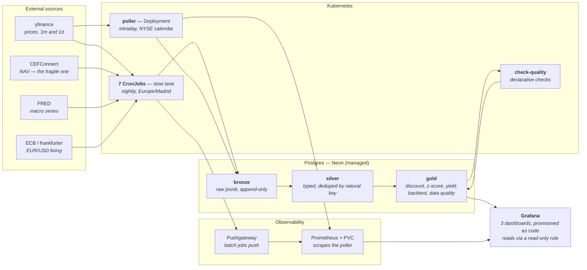

# k8s-market-sentinel

A **Kubernetes-native data platform** that watches US credit closed-end funds
(CEFs): it ingests price, NAV, distributions and macro signals, computes
discounts to NAV, their z-scores and distribution yield in a gold layer on
Postgres, and renders it in Grafana dashboards provisioned as code.

> **The thesis of this project is not the financial product — it's the portable
> architecture.** The CEF workload is the demonstration payload. CEFConnect and
> CEFData already publish discounts and z-scores; nobody needs another one. What
> is worth building, and what this repo is actually about, is the pattern:
> medallion layering, self-healing idempotent ingestion, config-driven
> everything, crash-only processes, dashboards as code, GitOps. Swap the payload
> and the platform stands.

> ## ⚠️ Disclaimer
>
> This project is **strictly educational** and a personal tracking tool.
> **Nothing in it — code, metrics, thresholds, alerts or documentation — is
> investment advice** or a recommendation to buy or sell any financial
> instrument. Data comes from free public sources (with delays, gaps and
> possible errors) and the metrics may simply be wrong. If you invest based on
> this, that is entirely your own responsibility.

---

## How the data flows



Deployment is a separate loop: **push to git → GitHub Actions builds and pushes
the image to GHCR → ArgoCD renders the Helm chart and syncs the cluster.** There
is no `kubectl apply` in the deploy path. For a step-by-step walkthrough of a
single datum from API call to panel, open
[docs/arquitectura.html](docs/arquitectura.html) (self-contained, no build step).

## What it does

- **Idempotent ingestion with backfill.** Every ingester asks *"what is my
  latest datum?"* and resumes from there, so the system heals itself after an
  outage: one run closes a week-long gap. Prices for ~44 tickers via yfinance,
  daily NAV per CEF from CEFConnect (the fragile piece, isolated in its own
  job), CEF distributions, FRED macro series and the official ECB EUR/USD fixing.
- **Intraday poller.** A crash-only Deployment that knows the real NYSE calendar
  (holidays, half days, transatlantic DST via `exchange_calendars`), batches 1m
  candles, sleeps interruptibly and exits cleanly on SIGTERM. Liveness is a
  **heartbeat file** touched by the loop itself — deliberately not the `/metrics`
  endpoint, which a separate daemon thread would keep answering `200` even with
  the loop hung.
- **Medallion on Postgres.** `bronze` (raw jsonb, append-only) → `silver`
  (typed, deduped) → `gold` (views: signed discount, 252-session z-score,
  *estimated* intraday discount, TTM yield on price and on NAV, Buffett
  indicator, signal backtest).
- **Grafana provisioned as code.** Dashboards and datasources live in the repo;
  the pod is stateless on purpose. Postgres access is a **read-only role**
  (`grafana_ro`, least privilege), and anonymous **viewer mode** is configuration
  too, not a user clicked into a UI — with no PVC, such a user would evaporate on
  the next restart.
- **Context, not bare numbers.** A lone level ("credit spread 2.84%") can't be
  judged. The gold layer computes percentile, z-score and *years of history
  available* per macro series, and where the source is licence-limited to a
  3-year rolling window, an unrestricted 40-year series is added **as a ruler** —
  without replacing the relevant one.
- **Declarative data quality.** Checks are **declared in
  `config/quality_checks.yaml`** — adding one is editing YAML, the code doesn't
  change. A runner executes them in a READ ONLY transaction, records the verdict
  with its history in gold, and **exits non-zero** if any fails, so Kubernetes
  marks the Job failed: data quality as a contract the orchestrator understands.
  NAV, the fragile piece, gets a **second opinion** — cross-checked against
  Yahoo's NAV ticker for the same fund, and `nav_quality` degrades itself to
  *suspicious* when the two sources diverge by more than 2%.
- **Packaged as a Helm chart.** A single multi-command image
  (`sentinel migrate|ingest-*|check-quality|poller`), 7 CronJobs generated from
  **one** template plus a list in `values.yaml`, and a switch per component: the
  minimal deployment is 10 resources, the full one 24.

## The payload is interchangeable; the platform isn't

Everything that ties this to closed-end funds is **configuration**, and it lives
in two files. Porting the platform to another data domain means, roughly:

| To change | Edit | Note |
|---|---|---|
| The universe of series | `config/tickers.yaml` | Adding a 40-year macro series to the project was a 1-line edit — no code, no schema change |
| Quality rules | `config/quality_checks.yaml` | SQL + thresholds; the runner doesn't change |
| A new ingester | `values.yaml` → `cronjobs:` | Four lines: name, schedule, CLI face, which config to mount |
| What gets deployed | `values.yaml` → `*.enabled` | `--set prometheus.enabled=false` for a cluster with no disk to spare |
| The schema | `db/migrations/` | Numbered, idempotent, applied by a Job |

What you'd write yourself is the ingester body — and even that has a shape to
copy: `src/sentinel/ingest/common.py` holds the backfill pattern that every
ingester in this repo reuses.

## Architectural honesty

This architecture is **deliberately over-engineered** for demonstration and
learning (Kubernetes, observability, CD). For actual personal use, a cron job
and a SQLite file would do. The point is to build the platform version while
knowing, at every decision, what the simple alternative would have been — and
writing that down. That record is [DECISIONS.md](DECISIONS.md): 58 numbered
decisions with their reasoning, their discarded alternatives and the lessons
that cost something. **It is in Spanish, and it is the most valuable file in the
repo.**

## Portable is not the same as permanent

Two properties that are easy to conflate:

- **Portability — achieved.** Everything needed to rebuild the system travels:
  the Helm chart, the ArgoCD Applications, the dashboards, the Prometheus config
  and even the **secrets, encrypted** (SOPS + age). The image lives in GHCR, the
  data in Neon. The only secret outside git is the age key, which travels with
  you. Destroying the cluster and rebuilding it from scratch in minutes is part
  of the normal workflow — it has been done several times.
- **Permanence (high availability) — pending.** The dev cluster is k3d inside
  Docker Desktop on a laptop. When the laptop is off, nobody runs: the ingestion
  CronJobs don't fire and they do **not** recover missed nights beyond
  `startingDeadlineSeconds`.

What saves the data across that gap is not the orchestrator but the **idempotent
backfill**. Kubernetes provides *process* robustness (a pod dies, a node falls,
someone drifts the cluster by hand); *data* robustness belongs to the
application. This got demonstrated without being staged: the poller died mid-day
and the cluster missed an entire trading session — and the next day's single run
recovered 13,612 candles across 43 tickers.

## Status

| Phase | Contents | Status |
|---|---|---|
| 0 | Architecture decisions | ✅ |
| 1 | Medallion schema + 4 ingesters validated against Neon | ✅ |
| 2 | Containerisation (single image, non-root) | ✅ |
| 3 | K8s: namespace, Secret, ConfigMap, CronJobs | ✅ |
| 4 | Intraday poller (Deployment with market-hours logic) | ✅ |
| 5 | Full gold layer + provisioned Grafana dashboards | ✅ |
| 5½ | Distributions + TTM yield | ✅ |
| 6 | CI/CD: GitHub Actions → GHCR + dependency lock | ✅ |
| 7 | GitOps-ready secrets (SOPS + age) and ArgoCD + KSOPS | ✅ |
| 8 | Telegram alerts with declarative rules | ⬜ parked |
| 8½ | Backtest of the discount signal | ✅ |
| 9 | Prometheus + PVC (full observability) | ✅ |
| 10 | Data quality as a declarative framework | ✅ |
| 11 | Helm chart, composite score, this README | ✅ |
| 12 | Remote access: `cloudflared` demo switch + viewer mode | ✅ |

## Quick start

> Just want to **see it running** on a machine that isn't yours?
> Go to **[DEMO.md](DEMO.md)**: dashboards with real data in ~3 minutes.

```bash
# 1. Config. With the project's age key, .env is generated from the ENCRYPTED
#    secret in the repo — no credentials copied by hand:
./scripts/env-from-secret.sh prod        # or 'local' for the compose Postgres
#    Without the age key: cp .env.example .env and fill it in.

# 2. Local dev stack (Postgres + Grafana + Prometheus + Pushgateway)
docker compose -f docker-compose.dev.yml up -d

# 3. Install and run
uv sync --extra dev
sentinel migrate              # apply SQL migrations
sentinel ingest-prices        # backfill the full universe
sentinel ingest-macro && sentinel ingest-fx && sentinel ingest-nav
sentinel ingest-distributions
sentinel ingest-nav-proxy     # second NAV source, for the cross-check
sentinel check-quality        # run config/quality_checks.yaml
sentinel poller               # (optional) live intraday, Ctrl+C to stop
pytest                        # 56 tests of the pure logic
```

### On Kubernetes

```bash
# k3d locally. --api-port is not decorative: k3d's random port often lands in a
# range Windows reserves, and the cluster becomes unreachable after a Docker
# restart (DECISIONS.md #22).
k3d cluster create sentinel --api-port 6550

helm install sentinel . -n sentinel --create-namespace
# The Secret is NOT created by the chart (#39): it lives encrypted in the repo
# and is applied by decrypting on the fly. Without this, pods won't start.
sops -d deploy/secrets/sentinel-env.prod.yaml | kubectl apply -f -
# Schema (idempotent: a no-op if already applied)
helm template . --set migrations.autoRun=true -s templates/job-migrate.yaml \
  | kubectl -n sentinel create -f -

kubectl -n sentinel port-forward svc/grafana 3000:3000   # → localhost:3000
```

With ArgoCD in place, none of the above is the deploy path: **deploying is
making a commit.** ArgoCD renders the chart with its own bundled Helm and
reconciles continuously — a manual `kubectl apply` gets reverted within minutes,
correctly, because git doesn't have it.

## Known limitations

Documented rather than hidden — the sources have real holes:

- **NAV backfill is limited to ~1 year** (CEFConnect's API gives no more daily
  history), so discounts before that simply don't exist.
- **The HY spread series is licence-limited to a ~3-year rolling window** in
  FRED. That's why a second, unrestricted series is ingested as a historical
  ruler.
- **Three CEFs have no NAV proxy on Yahoo** (BCAT, ADX, ARDC), so the NAV
  cross-check covers 16 of 19. A documented gap, not an error.
- **The backtest sample is small and correlated**: 43 signals, half of them from
  a single March 2026 sell-off. The panel says so on its face.

## License

[MIT](LICENSE) — use it, copy it and learn from it freely (under the disclaimer
above).
